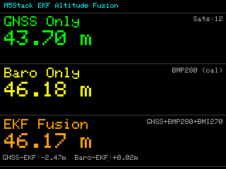

# M5Stack Altitude Measurement

[M5Stack Basic v2.7](https://docs.m5stack.com/en/core/basic_v2.7) + [M5Stack GNSS Module](https://docs.m5stack.com/en/module/GNSS%20Module) を使って、GNSS / BMP280(気圧センサ) / BMI270(6軸IMU) をEKFで融合し、高度を推定・表示・記録するプロジェクトです。

## 特徴

- EKF（2状態）による高度・垂直速度推定
- センサ入力
  - GNSS高度（低頻度）
  - BMP280気圧高度（高頻度）
  - BMI270加速度（予測ステップ）
- M5Stack LCD表示
  - GNSS単体高度
  - 気圧計単体高度
  - EKF融合高度
- MicroSDへ1秒周期でCSVログ保存
  - タイムスタンプ付き
  - 緯度/経度付き

## ハードウェア

- M5Stack Basic v2.7
- M5Stack GNSS Module（M-BUS接続）
  - GNSS: UART (GPIO16/17)
  - BMP280: I2C 0x76
  - BMI270: I2C 0x68

## 開発環境

- PlatformIO
- フレームワーク: Arduino (ESP32)
- ボード: `m5stack-core-esp32-16M`

## ビルド / 書き込み

```bash
pio run
pio run -t upload
```

## CSVログ

保存先（MicroSD）:

- `/altitude_log.csv`

ヘッダ:

```csv
timestamp_utc,uptime_ms,lat_deg,lon_deg,alt_gnss_m,alt_baro_m,alt_ekf_m,vel_mps,ekf_var_m2,sats,gnss_valid,baro_valid,ekf_initialized
```

補足:

- GNSS有効時は `timestamp_utc` にUTC日時を記録
- GNSS無効時は `timestamp_utc` に `UPTIME HH:MM:SS` を記録
- GNSS無効時の `lat_deg` / `lon_deg` / `alt_gnss_m` は空欄

## 主要ファイル

- `src/main.cpp`: センサ取得、EKF、表示、SDログ
- `platformio.ini`: PlatformIO設定

## スクリーンショット



## EKFの目的

本プロジェクトのEKF（拡張カルマンフィルタ）の目的は、センサごとの弱点を補いながら安定した高度を推定することです。

- GNSS高度: 絶対高度の基準として有効だが、更新が遅くノイズが大きい
- BMP280高度: 短期の変化に強く高頻度だが、気圧変動で長期ドリフトしやすい
- BMI270加速度: 反応は速いが、積分するとバイアス誤差が蓄積しやすい

EKFで「IMUによる連続予測」と「GNSS/BMP280による観測補正」を組み合わせることで、追従性と安定性を両立した高度推定を行います。

## EKFの演算処理

### 1) 状態ベクトル

- 状態: `x = [h, v]^T`
  - `h`: 高度 [m]
  - `v`: 垂直速度 [m/s]

### 2) 予測ステップ（IMU加速度を入力）

時間刻み `dt` ごとに、重力補正済み垂直加速度 `a_z` を使って状態を前進します。

- `h(k+1) = h(k) + dt * v(k) + 0.5 * dt^2 * a_z`
- `v(k+1) = v(k) + dt * a_z`

共分散は `P = F * P * F^T + Q` で更新します。

- `F = [[1, dt], [0, 1]]`
- `Q = σ_a^2 * [[dt^4/4, dt^3/2], [dt^3/2, dt^2]]`

ここで `σ_a` は加速度ノイズの標準偏差（実装では `Q_SIGMA_A`）です。

### 3) 更新ステップ（高度観測で補正）

GNSS高度とBMP280高度はどちらも「高度を直接観測する」モデルとして扱います。

- 観測モデル: `z = h + noise`
- 観測行列: `H = [1, 0]`

カルマンゲイン `K` で推定値を補正します。

- `S = HPH^T + R = P[0][0] + R`
- `K = P H^T S^-1`
- `x = x + K (z - Hx)`
- `P = (I - K H) P`

`R` は観測ノイズ分散で、BMP280用 (`R_BARO`) とGNSS用 (`R_GNSS`) を使い分けます。

### 4) 処理順序（1ループ内）

1. IMUから加速度取得 → 予測ステップ
2. BMP280高度で更新（高頻度）
3. GNSS高度は新規データ到着時のみ更新（低頻度）

この順序により、短周期ではIMU/BMP280で滑らかに追従し、長周期ではGNSSで絶対高度のずれを抑えます。

## EKFパラメータ調整の目安

実装で主に調整するのは以下の3つです。

- `R_BARO`（BMP280観測ノイズ分散）
- `Q_SIGMA_A`（プロセスノイズ、加速度ノイズ標準偏差）
- `R_GNSS`（GNSS観測ノイズ分散）

### `R_BARO` の目安

- 大きくする: BMP280の影響を弱める（短周期ノイズに強くなる）
- 小さくする: BMP280の影響を強める（短期変化に敏感になる）

症状ベースの調整:

- 高度表示が細かく揺れる → `R_BARO` を上げる
- 上下移動への追従が遅い → `R_BARO` を下げる

### `Q_SIGMA_A` の目安

- 大きくする: IMU予測を信頼しにくくなり、観測（BMP280/GNSS）寄りになる
- 小さくする: IMU予測を強く信頼し、加減速への追従が速くなる

症状ベースの調整:

- 推定高度が加減速に対して鈍い → `Q_SIGMA_A` を少し上げる
- 静止時に速度推定がふらつく → `Q_SIGMA_A` を少し下げる

### `R_GNSS` の目安

- 大きくする: GNSS補正を弱める（瞬間的なジャンプを抑える）
- 小さくする: GNSS補正を強める（絶対高度へ早く寄せる）

症状ベースの調整:

- GNSS更新タイミングでEKF高度が跳ねる → `R_GNSS` を上げる
- 長時間で絶対高度がずれる → `R_GNSS` を下げる

### 調整手順（推奨）

1. まず静止状態でログ取得し、`R_BARO` を調整して短周期の揺れを許容範囲にする
2. 次に上下移動テストで `Q_SIGMA_A` を調整し、応答速度と安定性のバランスを取る
3. 最後に屋外で `R_GNSS` を調整し、絶対高度の追従とジャンプ抑制を両立させる

一度に複数パラメータを大きく変更せず、1項目ずつ小刻みに変更してCSVログで比較するのが安全です。

### 初期推奨値セット

まずは以下の値から開始し、実測ログに合わせて微調整するのがおすすめです。

| 想定環境 | `R_BARO` | `Q_SIGMA_A` | `R_GNSS` | ねらい |
| --- | ---: | ---: | ---: | --- |
| 屋外（GNSS良好） | `0.09` | `0.30` | `16.0` | 絶対高度への追従をやや強める |
| 屋外（標準） | `0.09` | `0.30` | `25.0` | バランス重視（現行デフォルト） |
| 屋内/半屋内（GNSS不安定） | `0.12` | `0.25` | `64.0` | GNSSジャンプ抑制、Baro中心 |

補足:

- `R_*` は分散なので、標準偏差との関係は `R = σ^2`
- GNSS高度の標準偏差を約 `5 m` とみなす場合、`R_GNSS ≈ 25`
- BMP280高度の標準偏差を約 `0.3 m` とみなす場合、`R_BARO ≈ 0.09`

## ライセンス

MIT License（`LICENSE`）
